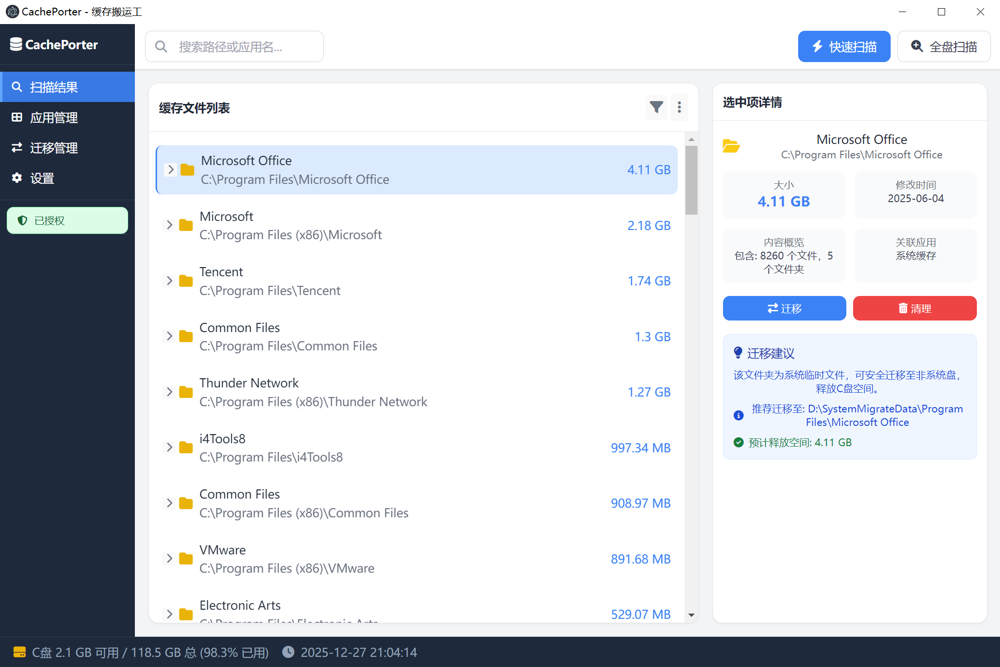
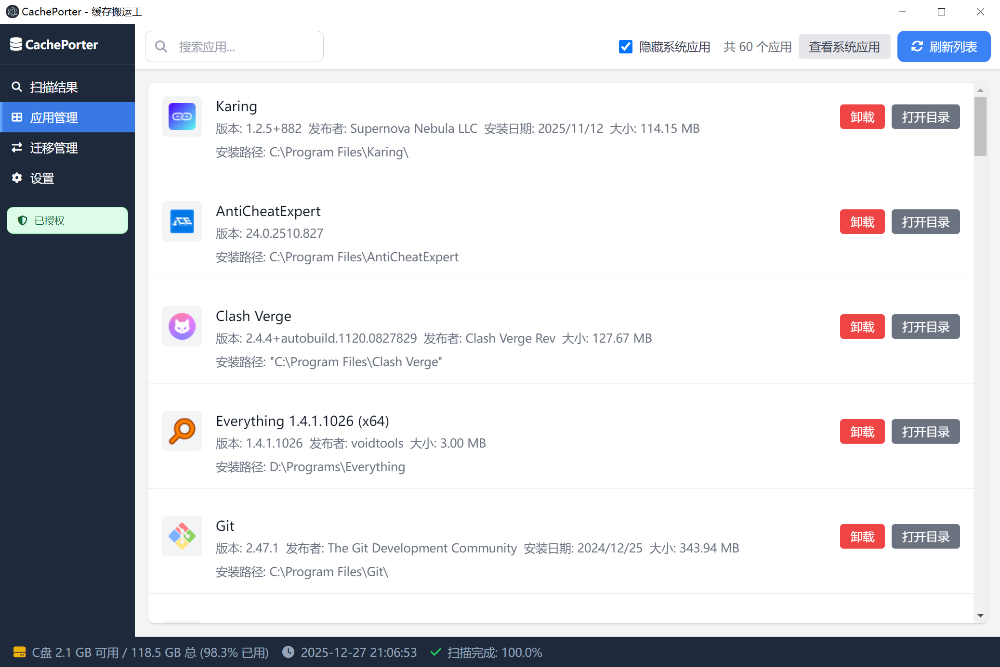
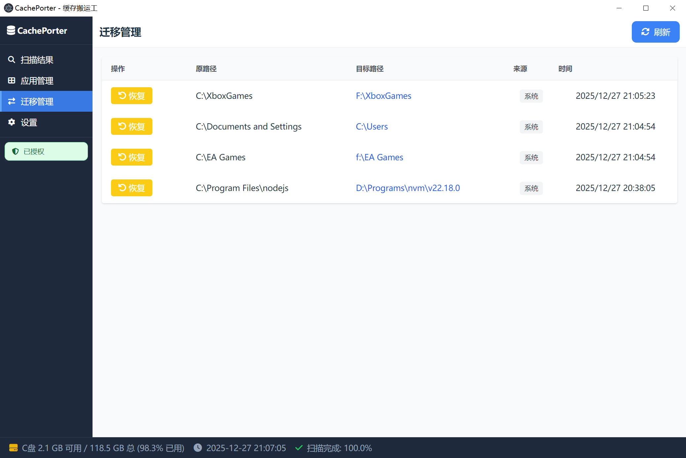
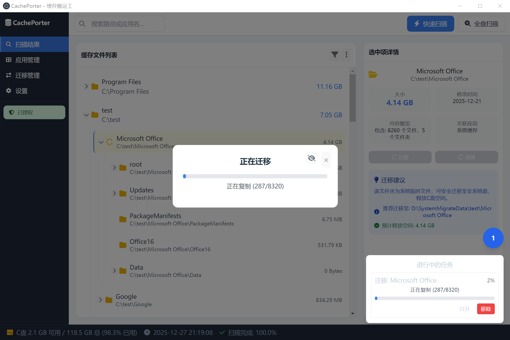

# CachePorter - 缓存搬运工

  

<h1 align="center">CachePorter - 缓存搬运工</h1>

  <strong>释放您的系统盘空间，让您的电脑重新焕发生机！</strong>

  <a href="https://cacheporter.plusitall.com/">官方网站: https://cacheporter.plusitall.com/</a>

---

## 🚀 什么是 CachePorter？

CachePorter（缓存搬运工）是一款专为Windows用户设计的强大磁盘空间管理工具。它能够智能扫描、识别并安全地迁移占用大量空间的应用缓存文件到非系统盘，通过符号链接（Junction/Symlink）技术确保应用正常访问，从而帮助您释放宝贵的系统盘空间。

## ✨ 主要功能

### 🔍 智能扫描
- 快速扫描指定目录及其子目录
- 按大小降序排列结果，一目了然
- 自动识别符号链接（Symlink/Junction）
- 隐藏小目录（默认小于100MB），突出显示大目录

### 🚀 高效迁移
- 一键迁移缓存到非系统盘
- 通过Junction/Symlink保持应用正常访问
- 支持批量迁移操作
- 迁移前进行安全校验

### 👁️ 实时反馈
- 实时显示扫描进度
- 直观的图形界面，操作简单
- 安全可靠，不会破坏应用运行

## 📸 产品截图

<!-- 项目中的宣传图片 -->

## 🎯 为什么选择 CachePorter？

- **安全可靠**：使用符号链接技术，确保应用正常运行
- **操作简单**：直观的图形界面，小白也能轻松上手
- **高效快速**：优化的扫描算法，快速定位大文件
- **批量处理**：一次可处理多个缓存目录
- **实时反馈**：扫描进度一目了然
- **免费开源**：完全免费，安全可靠

## 💻 系统要求

- Windows 操作系统
- 至少 2GB 可用磁盘空间
- 管理员权限（用于创建符号链接）

## 🚀 快速开始

1. 访问我们的官网下载最新版本：[https://cacheporter.plusitall.com/](https://cacheporter.plusitall.com/)
2. 安装并启动 CachePorter
3. 输入需要扫描的目录路径（如 `C:\Program Files`）
4. 点击"开始扫描"按钮
5. 查看扫描结果，选择需要迁移的缓存目录
6. 点击"迁移"按钮，将缓存迁移到非系统盘

## 🆘 遇到问题？

如果在使用过程中遇到任何问题，请查看我们的：

- [官方文档](https://cacheporter.plusitall.com/docs.html)
- [常见问题解答](https://github.com/leehonleon/CachePorter/issues)
- [技术支持](mailto:support@cacheporter.plusitall.com)

## 📄 许可证

本项目采用 MIT 许可证 - 详见 [LICENSE](./LICENSE) 文件

## 📞 联系我们

- 官网: [https://cacheporter.plusitall.com/](https://cacheporter.plusitall.com/)
- 邮箱: albertgroy@outlook.com
- GitHub: [https://github.com/leehonleon/CachePorter](https://github.com/leehonleon/CachePorter)

---

### CachePorter - 让您的电脑空间更自由！

**[立即访问官网](https://cacheporter.plusitall.com/)**

⭐ 如果这个项目对你有帮助，请给我们一个Star！

